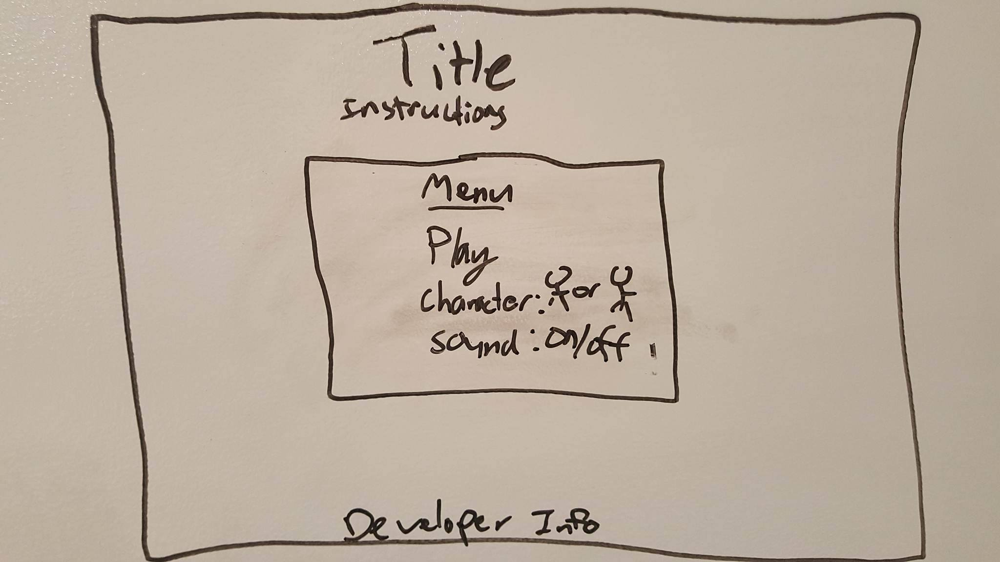

Flying Rick & Morty

If you've ever been frustrated by Flappy Bird and you're currently frustrated waiting for Rick & Morty season 3, prepare to be double frustrated!!!!

MVP:

1. A character appears on screen with an environment behind them.

2. When the player presses play the character and environment automatically start side scrolling with random obstacles appearing at random heights. This movement should happen smoothly.
3. When the character passes an obstacle cleanly the score counter goes up by 1 point.
4. When the character hits an obstacle the game ends and the player's score appears in a more easily readable display.
5. Add a restart button so the player can restart the game from the origin with their score back to zero.
6. After achieving a certain number of points has been reached the environment and character move faster.

The perfect game:

1. Includes a more interactive game menu screen that allows the player to choose their character and toggle sound.

2. I want the characters and environment in the game to be diverse and interactive.
3. The player should be able to pause the game in case of an external interruption.
4. A player should be able to retain their high-score during a play session that continues to show up in future game plays.
5. The collision that occurs to end a game is clear and is susceptable to chance of empty space.
6. The ending screen allows for options to return to menu, restart game, or change characters if the player would like.

[Trello!!!!!](https://trello.com/b/9AHPDZUr/wdi-sm-43-project-1)

Technologies:
	HTML, CSS, Javascript, and Canvas

The order of development of this game is straighforward and in this order: There needs to be a play button, a character, an environment with obstacles, a score tally, and the screen to side-scroll smoothly. All other code that follows will be to improve the quality and user interaction of the game.

Wireframes:

MVP wireframe:

Stretch wireframes:

![Stretch End] (assets/GameOver_wireframe.jpg)

Installation:  
Clone this github page and open index.html  [github](https://github.com/mld78/Project-1)
